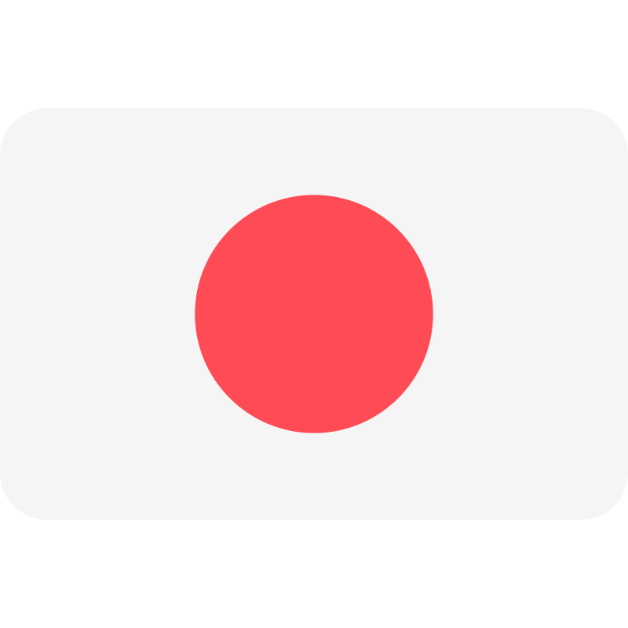

<body>

<h1 align="center" style="font-size:2rem;">Hi I'm Chris! I'm a french full-stack (more front-end & React oriented) developer, I work in IT since 2012</h1>

<h2 align="center">My informations</h2>

         
        
        

<h2 align="center">My front-end stack</h2>

    
    
    
    
    
    
    
    

<h2 align="center">My back-end stack</h2>

    
    
    
    

<h2 align="center">My work environment</h2>

    
    
    
    
    
    
    

<h2 align="center">My other skills</h2>

    
    
    

<h2 align="center">I speak</h2>

    
    

<h2 align="center">What I want to learn / What I'm learning right now</h2>

    
    

</body>
